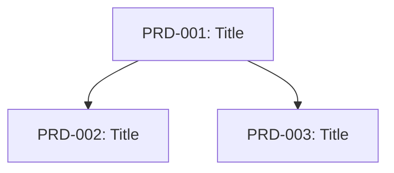

# pm:decompose

Decompose a roadmap item (epic/initiative) into independent, well-bounded PRDs with validated dependency management.

## Required Rules

**IMPORTANT:** Before executing this command, read and follow:
- `.claude/rules/datetime.md` - For getting real current date/time
- `.claude/rules/frontmatter-operations.md` - For frontmatter handling

## Usage

```
/pm:decompose <roadmap_item_path> [--max-prds N] [--strategy auto|vertical|spidr|story-map] [--dry-run]
```

## Preflight Checks

1. **Verify roadmap item path provided:**
   - If not provided: "❌ Roadmap item path required. Usage: /pm:decompose path/to/epic.md"

2. **Verify file exists:**
   - Check if `$ARGUMENTS.roadmap_item_path` exists
   - If not: "❌ File not found: $ARGUMENTS.roadmap_item_path"

3. **Validate frontmatter:**
   - File must have frontmatter with: id or name, title or name, description
   - If invalid: "❌ Invalid frontmatter. Required: id/name, title, description"

4. **Check output directory:**
   - Ensure `$OPTIONS.output-dir` exists or can be created

## Execution Steps

### Step 1: Load and Parse Input

Read the roadmap item file and extract:

```yaml
# Required fields
id: string          # Unique identifier (e.g., EPIC-001)
title: string       # Short descriptive title
description: string # Full description

# Optional fields
type: epic|feature|initiative
goals: list[string]
constraints: list[string]
success_criteria: list[string]
```

Store extracted data for decomposition.

### Step 2: Select Decomposition Strategy

If `$OPTIONS.strategy` is "auto", analyze the item:

| Characteristic | Strategy |
|----------------|----------|
| Large scope (epic) | story-map |
| Multiple user journeys | spidr (paths) |
| Complex business rules | spidr (rules) |
| Data variations | spidr (data) |
| Default | vertical |

Otherwise use the specified strategy.

### Step 3: Generate PRD Decomposition

Using the selected strategy, generate PRDs with this prompt structure:

```
You are an expert product manager decomposing a roadmap item into independent PRDs.

## Context
Title: {title}
Description: {description}
Goals: {goals}
Constraints: {constraints}
Strategy: {selected_strategy}

## Decomposition Rules (CRITICAL)
1. Each PRD must deliver STANDALONE USER VALUE
2. Use VERTICAL SLICES (touch all layers: UI → API → Data)
3. Target {min_prds} to {max_prds} PRDs

## Anti-Patterns to AVOID
- ❌ Splitting by technical component (frontend/backend/database)
- ❌ Splitting by process step without independent value
- ❌ Separating happy path from error handling
- ❌ Building "core" without end-to-end functionality
- ❌ Splitting CRUD operations separately
- ❌ Splitting by non-varying data (phone, email, address)

## SPIDR Techniques (apply in order: R → D → I → P → S)
- Rules: Can we defer complex business rules to simplify?
- Data: Are there meaningful data variations?
- Interface: Do interfaces differ significantly?
- Paths: Are there alternative user paths?
- Spikes: Is research needed before deciding?

## Good Decomposition Example
Input: "User can purchase products online"
Output PRDs:
1. "Purchase single product with credit card" (MVP vertical slice)
2. "Purchase with alternative payment methods" (PayPal, Apple Pay)
3. "Purchase multiple products in one transaction"
4. "Apply discount codes to purchase"

## Output Format
For each PRD provide:
- id: PRD-{EPIC_ID}-{NUM} (e.g., PRD-AUTH-001)
- title: Short descriptive title (< 80 chars)
- user_story: "As a {role}, I want {goal}, so that {benefit}"
- acceptance_criteria: 3-5 testable criteria using Given-When-Then
- dependencies: List of PRD IDs this depends on (empty if none)
- size: XS|S|M|L|XL
- tags: Categorization tags
```

Validate the output:
- Must be valid JSON with `prds` array
- PRD count must be between min and max
- Each PRD must have required fields

If invalid, regenerate with feedback.

### Step 4: INVEST Validation

For each generated PRD, calculate INVEST scores:

| Criterion | Weight | Scoring Method |
|-----------|--------|----------------|
| Independent | 0.25 | Penalize dependency keywords: "depends on", "requires", "after", "blocked by" |
| Negotiable | 0.05 | Check for flexibility indicators |
| Valuable | 0.20 | Check: user role present, "so that" benefit, action verbs |
| Estimable | 0.15 | Check: clear scope, no ambiguous terms |
| Small | 0.15 | Check: criteria count (3-7 ideal), reasonable scope |
| Testable | 0.20 | Check: acceptance criteria quality, Given-When-Then format |

**Independence Score:**
- Start at 1.0
- Subtract 0.15 for each dependency keyword found
- Subtract 0.20 for each explicit dependency
- Minimum 0.0

**Value Score:**
- +0.3 if user role present ("As a...")
- +0.3 if benefit present ("so that...")
- +0.2 if action verbs present (create, view, manage, track, etc.)
- +0.2 if technical jargon ratio < 20%

**Testability Score:**
- +0.4 if acceptance criteria present
- +0.3 × (structured criteria ratio) for Given-When-Then format
- +0.3 if measurable outcomes present (numbers, percentages)

**Composite Score:**
```
composite = Σ(score[i] × weight[i])
```

**Conflict Detection:**
- If independence < 0.6 AND small > 0.8: "Trade-off: high small score may indicate broken independence"

### Step 5: Build Dependency Graph

1. **Extract explicit dependencies** from PRD definitions
2. **Detect implicit dependencies:**
   - Entity co-references (PRD A creates X, PRD B uses X → A blocks B)
   - Temporal language ("after", "once", "when X is done")
3. **Construct DAG** with nodes (PRD IDs) and edges (dependencies)
4. **Cycle detection** using depth-first search:
   - If cycle found, attempt to remove lowest-confidence implicit edge
   - If unresolvable, flag for human review

**DAG Validation:**
- is_valid: No cycles
- max_depth: Longest path (warn if > 5)
- orphans: PRDs with no dependencies and no dependents (may be fine)

### Step 6: Anti-Pattern Detection

Check for these anti-patterns:

| Anti-Pattern | Severity | Detection |
|--------------|----------|-----------|
| horizontal_slice | HIGH | Single layer keywords only (frontend, backend, database) |
| happy_path_only | HIGH | No error/fail/invalid keywords, "happy path" mentioned |
| core_first | HIGH | "core/base/foundation" + no user outcome |
| process_step_split | MEDIUM | Sequential markers + no standalone value |
| crud_split | MEDIUM | Same entity, different CRUD verbs only |
| trivial_data_split | MEDIUM | PRDs differ only by field names |
| superficial_interface | MEDIUM | PRDs differ only by web/mobile |
| bad_conjunction_split | MEDIUM | Setup-only PRD with no outcome |
| superficial_role_split | MEDIUM | Same functionality, only role differs |
| test_case_as_prd | MEDIUM | Test language dominates content |

### Step 7: Calculate Confidence

```
confidence = (
    consistency × 0.30 +           # LLM output quality
    avg_invest_composite × 0.30 +  # Average INVEST score
    dag_valid × 0.20 +             # 1.0 if valid, 0.05 if cycles detected
    (0.20 - antipattern_penalty)   # Subtract 0.10 per HIGH, 0.05 per MEDIUM
)
```

Confidence thresholds:
- > 0.9: Auto-approve
- 0.7-0.9: Light review
- 0.5-0.7: Full review required
- < 0.5: Consider regenerating

### Step 8: Output Generation

If `$OPTIONS.dry-run` is "true":
- Display summary of what would be generated
- Exit without writing files

Otherwise, create output structure:

```
{output-dir}/
├── {epic_id}/
│   ├── decomposition-summary.md
│   ├── dependency-graph.json
│   ├── dependency-graph.mermaid
│   ├── validation-report.md
│   ├── PRD-{EPIC}-001.md
│   ├── PRD-{EPIC}-002.md
│   └── ...
```

#### PRD File Template

```markdown
---
id: PRD-{EPIC}-{NUM}
title: {title}
status: draft
created: {current_datetime}
updated: {current_datetime}
epic: {epic_id}
size: {XS|S|M|L|XL}
tags: [{tags}]
invest_composite: {0.00}
review_required: {true|false}
dependencies: [{dep_ids}]
---

# {title}

## User Story

**As a** {role},
**I want** {goal},
**So that** {benefit}.

## Description

{description}

## Acceptance Criteria

1. **[FUNCTIONAL]** {criterion}
   - Given {precondition}
   - When {action}
   - Then {expected result}

2. ...

## Dependencies

| PRD ID | Type | Description |
|--------|------|-------------|
| {dep_id} | blocks | {why} |

## Out of Scope

- {excluded item 1}
- {excluded item 2}

## INVEST Score

| Criterion | Score | Notes |
|-----------|-------|-------|
| Independent | {0.00} | {note} |
| Negotiable | {0.00} | {note} |
| Valuable | {0.00} | {note} |
| Estimable | {0.00} | {note} |
| Small | {0.00} | {note} |
| Testable | {0.00} | {note} |
| **Composite** | **{0.00}** | |

---
*Generated by pm:decompose on {datetime}*
```

#### Dependency Graph (Mermaid)



#### Validation Report

```markdown
# Validation Report: {epic_id}

## Summary
- PRDs Generated: {count}
- Average INVEST Score: {avg}
- DAG Valid: {yes/no}
- Confidence: {score}
- Review Required: {yes/no}

## INVEST Scores

| PRD | I | N | V | E | S | T | Composite |
|-----|---|---|---|---|---|---|-----------|
| PRD-001 | 0.9 | 0.7 | 0.8 | 0.8 | 0.7 | 0.9 | 0.82 |

## Anti-Pattern Warnings

| Pattern | Severity | PRDs | Recommendation |
|---------|----------|------|----------------|
| {pattern} | {HIGH/MEDIUM} | {ids} | {recommendation} |

## Dependency Analysis

- Chain Depth: {depth}
- Parallel Groups: {count}
- Orphan PRDs: {list}
```

### Step 9: Review Decision

If confidence < `$OPTIONS.confidence-threshold` OR `$OPTIONS.review` is "true":
- Mark all PRDs as `review_required: true`
- Output warning with issues

## Output Format

### Success

```
✅ Decomposition complete

Generated {N} PRDs from {epic_id}:
- PRD-{EPIC}-001: {title} (INVEST: {score})
- PRD-{EPIC}-002: {title} (INVEST: {score})
...

Dependency chain depth: {depth}
Parallel groups: {groups}
Confidence: {score}

Files written to: {output_dir}/{epic_id}/

{If review required:}
⚠️ Human review required (confidence: {score})
Issues:
- {issue 1}
- {issue 2}

Next steps:
- Review PRDs in {output_dir}/{epic_id}/
- Run /pm:epic-start {epic_id} when ready
```

### Failure

```
❌ Decomposition failed: {reason}

{If partial results:}
Partial results saved to: {output_dir}/{epic_id}/partial/

Suggestions:
- {suggestion 1}
- {suggestion 2}
```

## Examples

### Basic Usage
```bash
/pm:decompose .claude/epics/user-auth/epic.md
```

### With Options
```bash
/pm:decompose .claude/epics/user-auth/epic.md --max-prds 5 --strategy spidr
```

### Dry Run
```bash
/pm:decompose .claude/epics/user-auth/epic.md --dry-run
```

### Force Review
```bash
/pm:decompose .claude/epics/user-auth/epic.md --review
```

### Custom Output Directory
```bash
/pm:decompose .claude/epics/user-auth/epic.md --output-dir ./auth-prds
```

## Error Handling

| Error | Cause | Resolution |
|-------|-------|------------|
| `FILE_NOT_FOUND` | Path invalid | Check path exists |
| `INVALID_FORMAT` | Missing required fields | Add frontmatter with id, title, description |
| `LLM_FAILURE` | Generation failed | Retry or simplify input |
| `CYCLE_DETECTED` | Unresolvable dependency cycle | Manual intervention required |
| `TOO_MANY_PRDS` | Decomposition too granular | Increase --min-prds or use --strategy |
| `TOO_FEW_PRDS` | Item too small | Decrease --max-prds or skip decomposition |

## Integration Points

### Input Sources
- Epic files from `.claude/epics/*/epic.md`
- Roadmap items from `.claude/roadmaps/`
- Initiative markdown files

### Output Consumers
- `/pm:prd-parse` - Convert PRDs to technical epics
- `/pm:epic-start` - Begin work on decomposed epic
- `/pm:issue-sync` - Sync PRDs to GitHub issues

## IMPORTANT

- Each PRD must deliver **standalone user value** - this is the primary quality criterion
- Prefer **vertical slices** that touch all system layers over horizontal decomposition
- Target **3-7 PRDs** for most epics - fewer for focused features, more for large initiatives
- Always validate INVEST scores and address HIGH severity anti-patterns before proceeding
- Human review is **mandatory** when confidence < 0.7

## Research Foundation

This skill implements algorithms from deep research on PRD decomposition:
- SPIDR framework (Mountain Goat Software)
- INVEST criteria (Agile Alliance)
- Vertical slice architecture (Jimmy Bogard)
- 10 story splitting anti-patterns (Humanizing Work)
- DAG algorithms (Kahn's topological sort, Tarjan's cycle detection)

See: `RESEARCH/roadmap-decomposition/research-report.md`
